# LangGraph Research Project: Advanced Multi-Model Workflows

> **Комплексный проект для изучения продвинутых паттернов LangGraph с локальными моделями**

## 🎯 Обзор проекта

Этот проект демонстрирует enterprise-grade паттерны для построения отказоустойчивых AI-систем с использованием LangGraph и локальных моделей Ollama. От простых workflows до сложных multi-model систем принятия решений.

## 🚀 Быстрый старт

### Предварительные требования
1. **Python 3.12+** и **uv**
2. **Ollama** с моделями: `llama3.2:1b`, `llama3.2:3b`, `llama3.1:8b`

### Установка
```bash
# Установите зависимости
uv sync

# Убедитесь что Ollama запущен
ollama serve

# Скачайте модели (если не установлены)
ollama pull llama3.2:1b
ollama pull llama3.2:3b  
ollama pull llama3.1:8b
```

### Запуск примеров
```bash
# Базовая проверка
python run_example.py basic

# Запуск по фазам (рекомендуемая последовательность)
python run_example.py 2  # Обработка документов
python run_example.py 3  # Условное ветвление
python run_example.py 4  # Retry механизмы
python run_example.py 5  # Fallback стратегии
python run_example.py 6  # Комплексный workflow (ФИНАЛ)
```

## 📋 Структура проекта

```mermaid
graph TD
    A[Project Root] --> B[src/]
    A --> C[examples/]
    A --> D[docs/]
    
    B --> E[models/]
    B --> F[nodes/]
    B --> G[workflows/]
    
    E --> E1[local_model_manager.py]
    E --> E2[model_configs.py]
    E --> E3[fallback_chain.py]
    E --> E4[retry_handler.py]
    
    F --> F1[classification.py]
    F --> F2[processing.py]
    F --> F3[decision.py]
    F --> F4[loan_processing_nodes.py]
    
    G --> G1[state.py]
    G --> G2[document_processing.py]
    G --> G3[conditional_workflow.py]
    G --> G4[loan_application_state.py]
    G --> G5[complex_loan_workflow.py]
    
    C --> H[Phase Examples]
    H --> H1[basic_setup_test.py]
    H --> H2[phase2_document_processing.py]
    H --> H3[phase3_conditional_branching.py]
    H --> H4[phase4_retry_mechanisms.py]
    H --> H5[phase5_fallback_strategies.py]
    H --> H6[phase6_complex_workflow.py]
```

## 🚀 6-фазное обучение

### Phase 1: Базовая настройка

**Цель:** Настройка локальных моделей и базовых retry/fallback механизмов

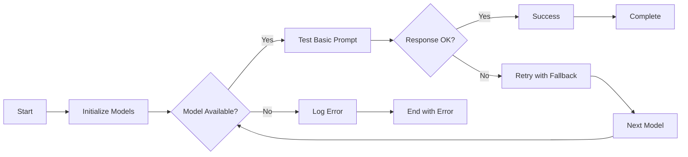

**Ожидаемые результаты:**
- ✅ 3 модели инициализированы (Fast: llama3.2:1b, Standard: llama3.2:3b, Reasoning: llama3.1:8b)
- ✅ Базовые retry механизмы работают
- ✅ Fallback между моделями при сбоях

### Phase 2: Простая обработка документов

**Цель:** Создание LangGraph workflow для обработки документов

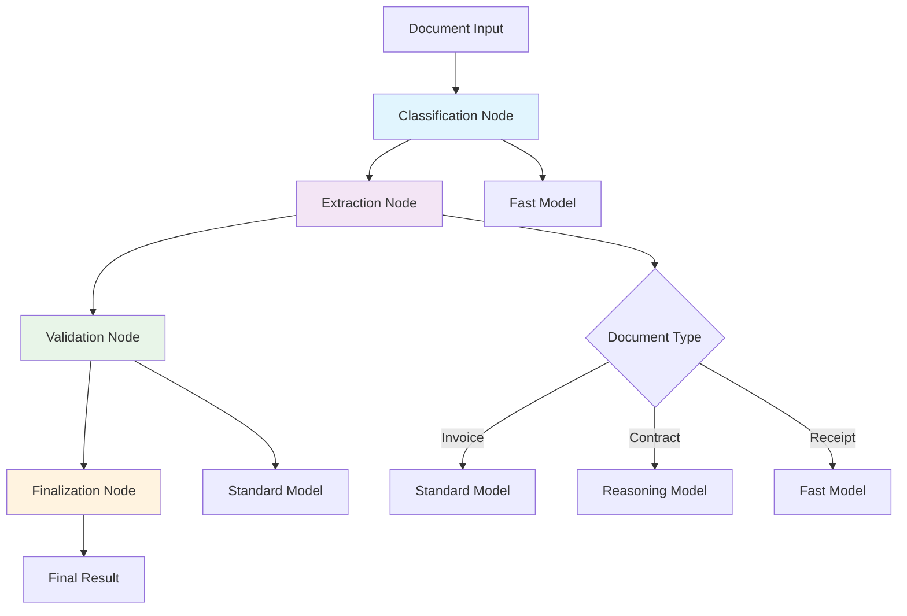

**Тестовые сценарии:**
- 📄 Invoice processing
- 📄 Contract analysis
- 📄 Receipt extraction

**Ожидаемые результаты:**
- ✅ Классификация документов с confidence scores
- ✅ Структурированное извлечение данных в JSON
- ✅ Валидация извлеченной информации
- ✅ Среднее время: ~8.6 секунд на документ

### Phase 3: Условное ветвление

**Цель:** Интеллектуальная маршрутизация на основе характеристик документов

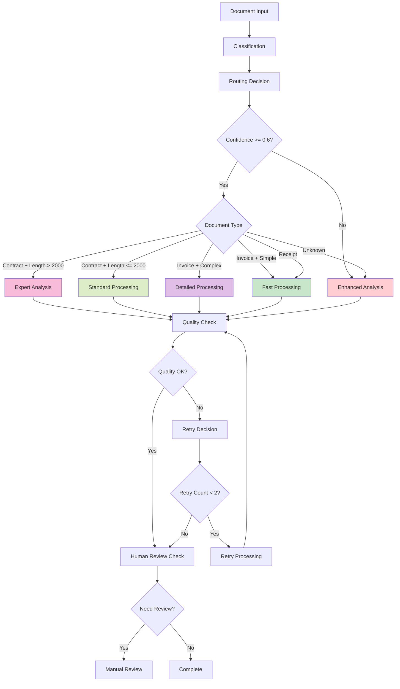

**Маршрутизация:**
- 🔀 **Enhanced Analysis**: Confidence < 0.6
- 🔀 **Expert Analysis**: Complex contracts (>2000 chars)
- 🔀 **Detailed Processing**: Complex invoices
- 🔀 **Fast Processing**: Simple documents
- 🔀 **Standard Processing**: Standard contracts

**Ожидаемые результаты:**
- ✅ Автоматическое переключение между 5 путями обработки
- ✅ Retry механизмы с улучшенными моделями
- ✅ Human review triggers для edge cases

### Phase 4: Продвинутые retry механизмы

**Цель:** Circuit breakers и exponential backoff

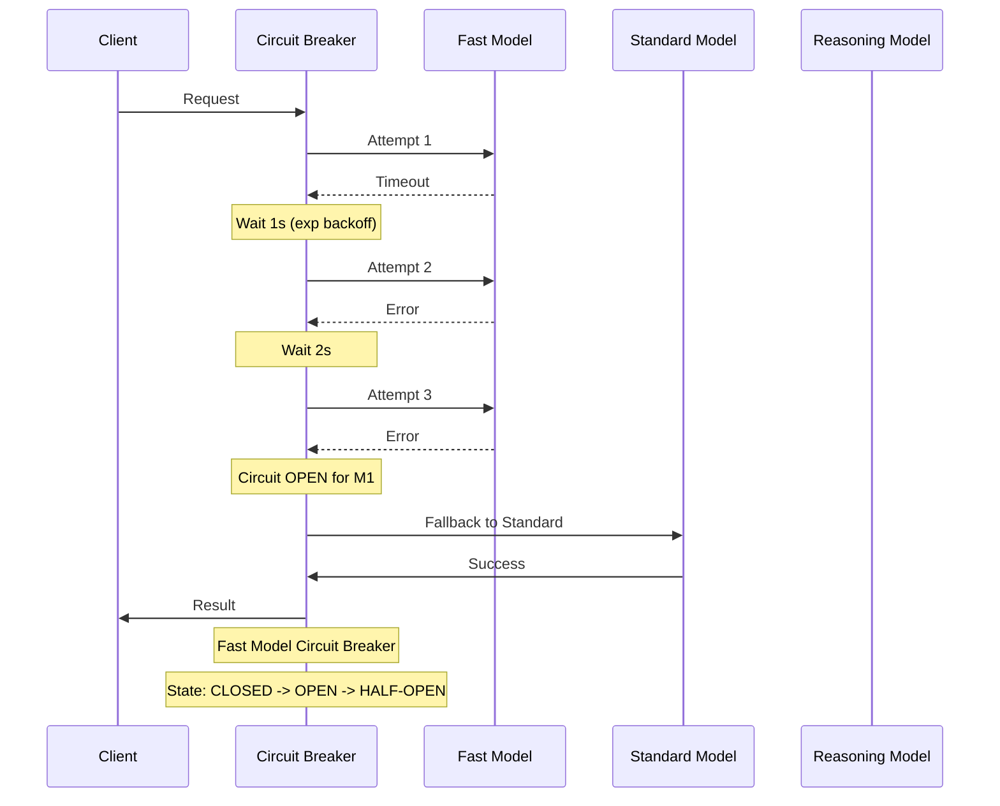

**Retry стратегии по моделям:**
- **Fast Model**: 4 попытки, base_delay=0.5s
- **Standard Model**: 3 попытки, base_delay=1.0s  
- **Reasoning Model**: 2 попытки, base_delay=2.0s

**Circuit Breaker состояния:**
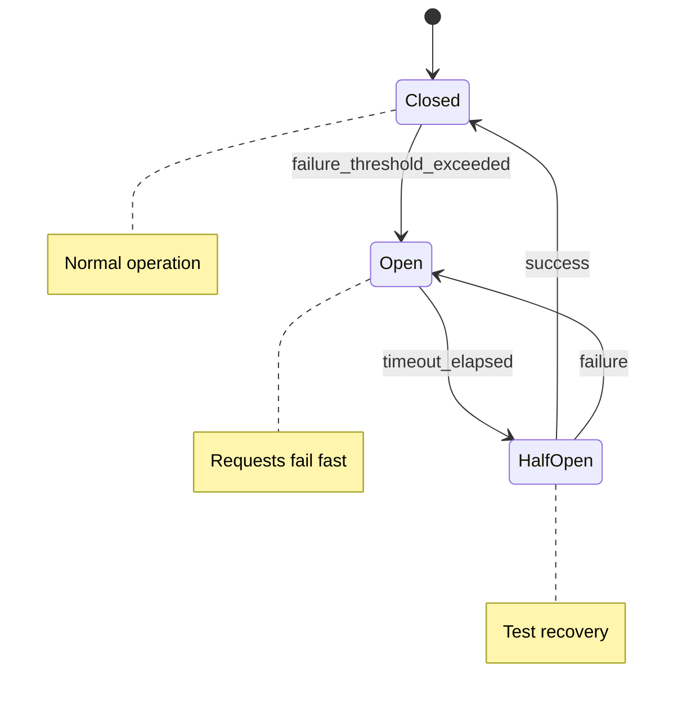

**Ожидаемые результаты:**
- ✅ Exponential backoff: 1s → 2s → 4s → 8s
- ✅ Circuit breakers для каждой модели
- ✅ Автоматическое восстановление (half-open → closed)
- ✅ 100% success rate для Standard/Reasoning моделей

### Phase 5: Сложные стратегии отказоустойчивости

**Цель:** 5-уровневые fallback стратегии с кэшированием

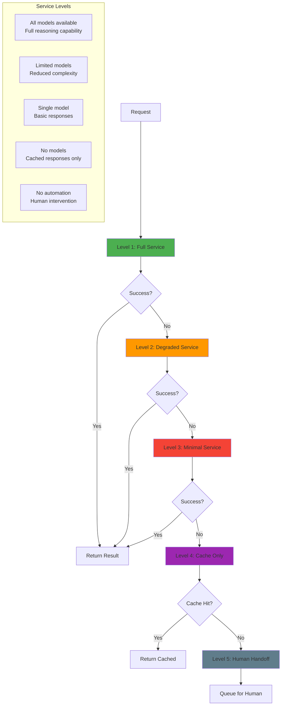

**Кэширование стратегии:**

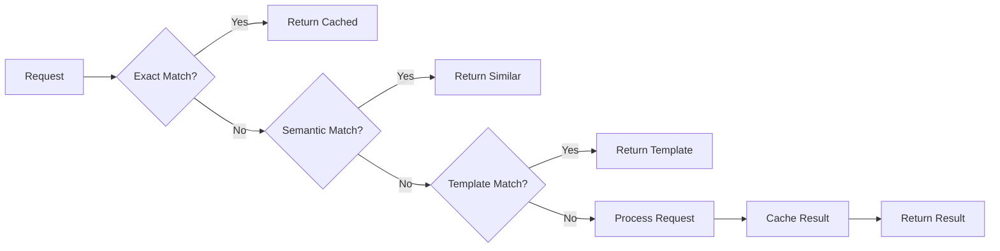

**Model Voting System:**
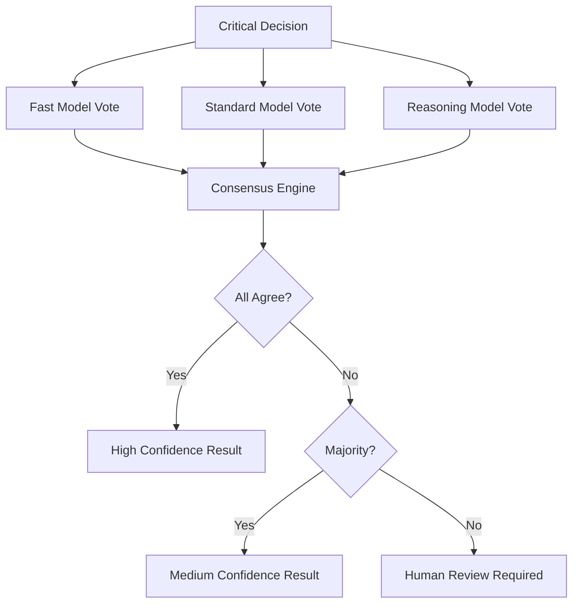

**Ожидаемые результаты:**
- ✅ 5 уровней деградации сервиса
- ✅ Model voting для критических решений
- ✅ Intelligent caching (exact/semantic/template)
- ✅ Human handoff queue management
- ✅ 100% uptime даже при полных сбоях моделей

### Phase 6: Комплексный бизнес-процесс

**Цель:** Реальная система обработки кредитных заявок

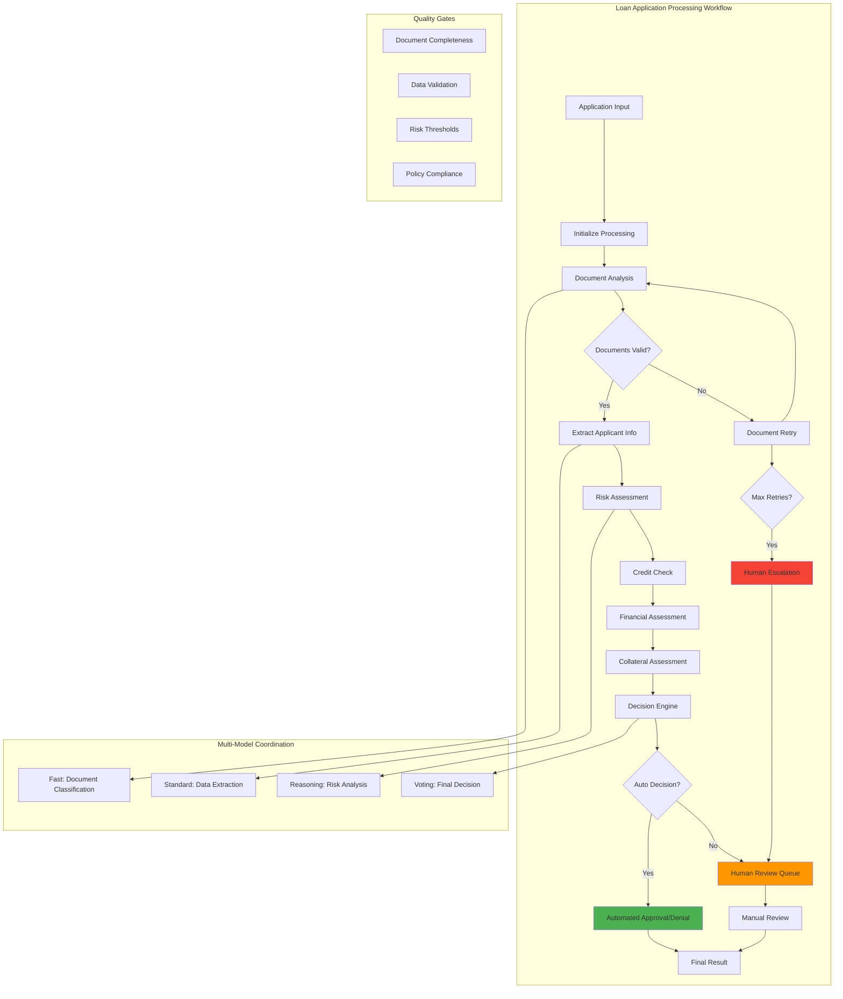

**Типы кредитных заявок:**

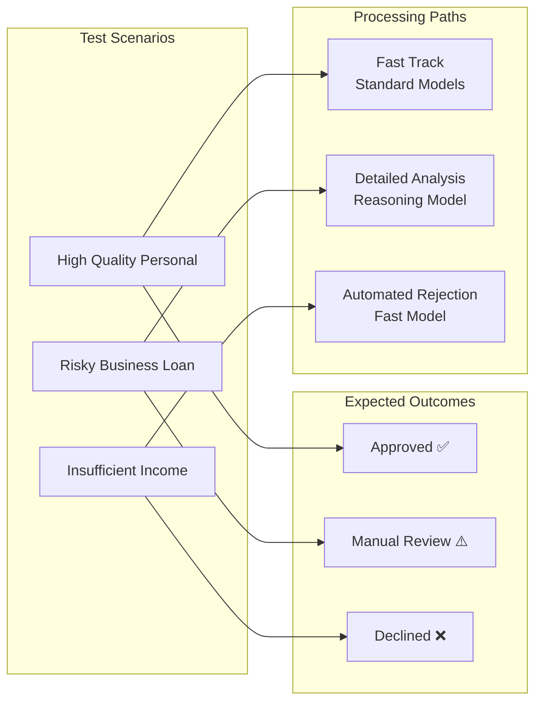

**Детальный workflow обработки заявки:**

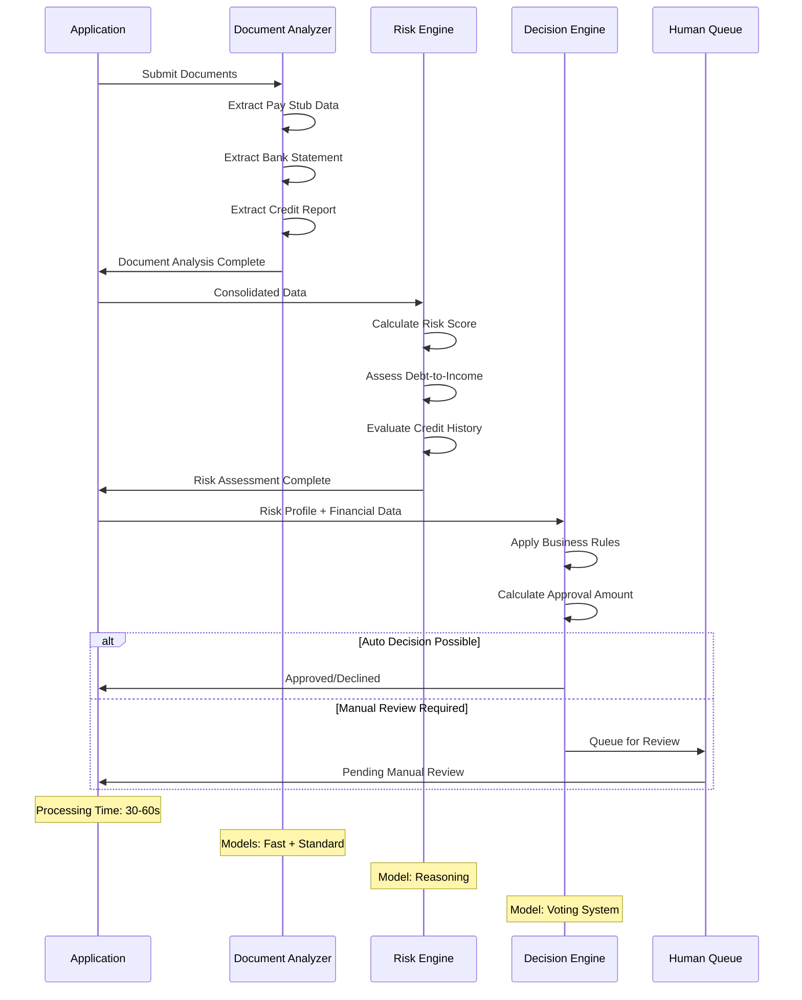

**Система принятия решений:**

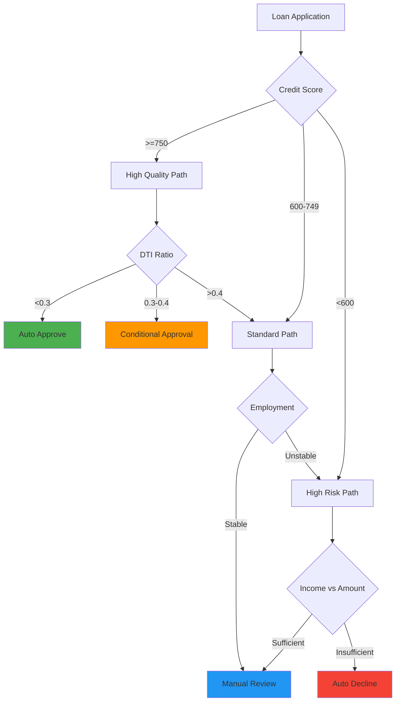

**Ожидаемые результаты:**
- ✅ Обработка 3 типов заявок с разными исходами
- ✅ Multi-model coordination: 30+ model operations
- ✅ Advanced retry patterns: exponential backoff + circuit breakers
- ✅ Human escalation для edge cases
- ✅ Детальная трассировка каждого решения
- ✅ Enterprise-grade отказоустойчивость

## 🏗️ Архитектурные паттерны

### 1. Multi-Model Coordination

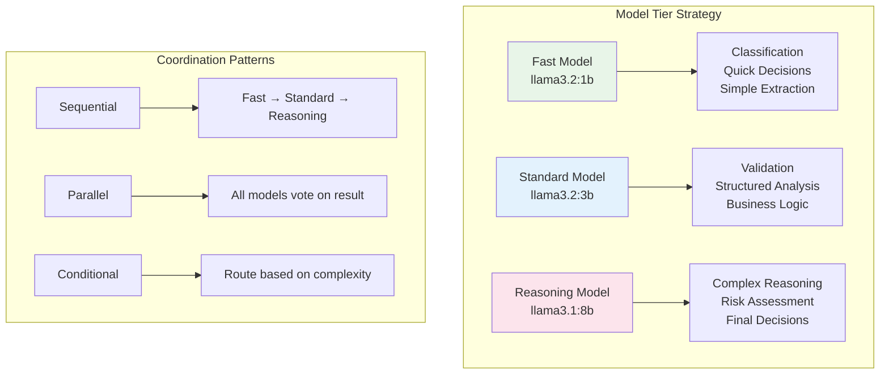

### 2. State Management

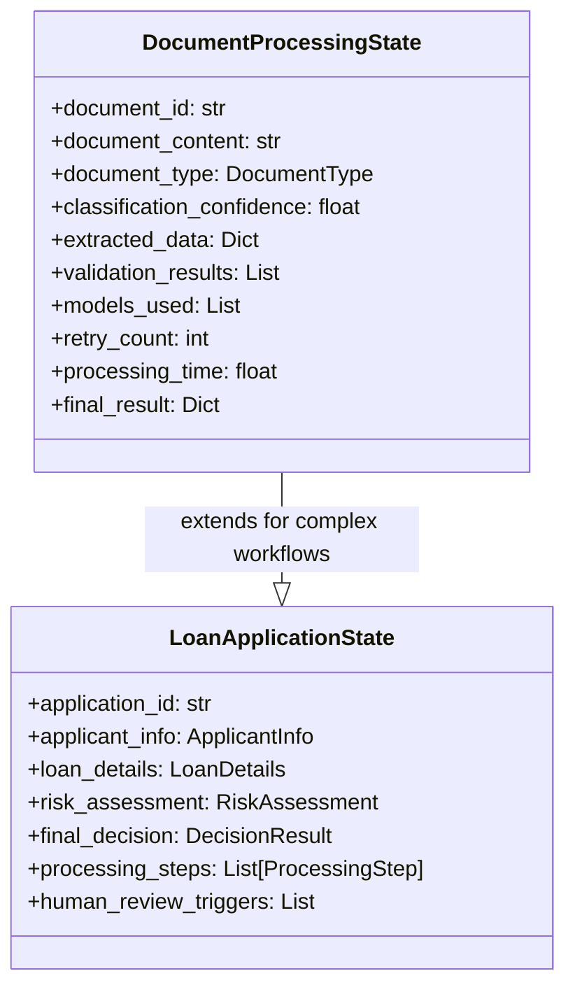

### 3. Error Handling Strategy

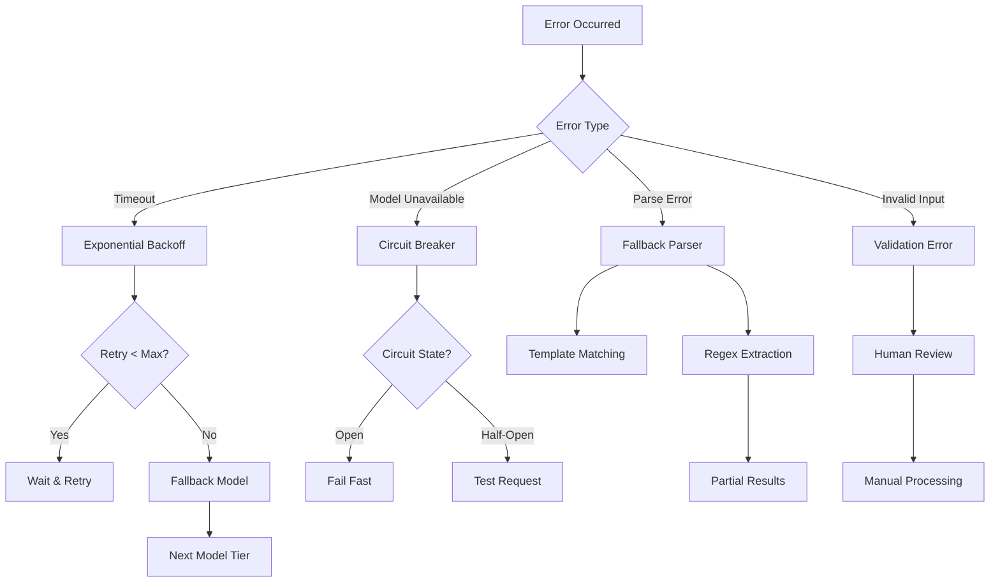

## 🔧 Технические детали

### Модели и их роли

| Модель | Размер | Роль | Use Cases |
|--------|--------|------|-----------|
| **llama3.2:1b** | Fast | Classification, Quick decisions | Document type detection, Simple extraction |
| **llama3.2:3b** | Standard | Validation, Structured analysis | Data validation, Business rules |  
| **llama3.1:8b** | Reasoning | Complex reasoning, Final decisions | Risk assessment, Complex analysis |

### Retry конфигурации

```yaml
Fast Model:
  max_attempts: 4
  base_delay: 0.5s
  strategy: exponential_backoff
  circuit_breaker: 3 failures

Standard Model:
  max_attempts: 3
  base_delay: 1.0s
  strategy: exponential_backoff
  circuit_breaker: 2 failures

Reasoning Model:
  max_attempts: 2
  base_delay: 2.0s
  strategy: exponential_backoff
  circuit_breaker: 2 failures
```

### Fallback уровни

1. **Full Service** - все модели доступны
2. **Degraded Service** - ограниченные модели  
3. **Minimal Service** - одна модель
4. **Cache Only** - только кэшированные ответы
5. **Human Handoff** - ручная обработка

## 📊 Метрики производительности

### Ожидаемые результаты по фазам

```mermaid
gantt
    title Ожидаемое время выполнения фаз
    dateFormat X
    axisFormat %s
    
    section Phase 1
    Basic Setup: 0, 5s
    
    section Phase 2  
    Document Processing: 0, 30s
    
    section Phase 3
    Conditional Branching: 0, 60s
    
    section Phase 4
    Retry Mechanisms: 0, 45s
    
    section Phase 5
    Fallback Strategies: 0, 40s
    
    section Phase 6
    Complex Workflow: 0, 180s
```

### Success Rate цели

| Фаза | Target Success Rate | Key Metrics |
|------|-------------------|-------------|
| Phase 1 | 100% | Model initialization |
| Phase 2 | 95% | Document processing accuracy |
| Phase 3 | 90% | Correct routing decisions |
| Phase 4 | 100% | Circuit breaker functionality |
| Phase 5 | 100% | Fallback system resilience |
| Phase 6 | 85% | End-to-end business process |

## 🚦 Статусы и индикаторы

### Circuit Breaker статусы
- 🟢 **CLOSED** - Normal operation
- 🔴 **OPEN** - Failing fast, requests rejected
- 🟡 **HALF-OPEN** - Testing recovery

### Processing статусы
- ⏳ **IN_PROGRESS** - Currently processing
- ✅ **COMPLETED** - Successfully finished
- ❌ **FAILED** - Error occurred
- ⚠️ **REQUIRES_REVIEW** - Needs human intervention
- 🔄 **RETRYING** - Attempting retry

## 📖 Использование

### Запуск отдельных фаз

```bash
# Базовая настройка
python run_example.py basic

# Phase 2: Обработка документов
python run_example.py 2

# Phase 3: Условное ветвление  
python run_example.py 3

# Phase 4: Retry механизмы
python run_example.py 4

# Phase 5: Fallback стратегии
python run_example.py 5

# Phase 6: Комплексный workflow (финал)
python run_example.py 6
```

### Прямой запуск
```bash
python examples/phase2_document_processing.py
python examples/phase3_conditional_branching.py
python examples/phase4_retry_mechanisms.py
python examples/phase5_fallback_strategies.py
python examples/phase6_complex_workflow.py
```

## 🎓 Изученные паттерны

По завершении всех фаз вы овладеете:

### Enterprise Patterns
- ✅ **Multi-model orchestration** - координация разных моделей
- ✅ **Circuit breaker patterns** - защита от каскадных сбоев
- ✅ **Exponential backoff** - интеллектуальные повторные попытки
- ✅ **Graceful degradation** - плавная деградация сервиса
- ✅ **Human-in-the-loop** - эскалация к человеку

### LangGraph Expertise  
- ✅ **Conditional workflows** - динамическая маршрутизация
- ✅ **State management** - управление сложным состоянием
- ✅ **Node composition** - композиция обработчиков
- ✅ **Error boundaries** - изоляция ошибок
- ✅ **Quality gates** - контрольные точки качества

### Production Readiness
- ✅ **Comprehensive monitoring** - детальное логирование
- ✅ **Performance optimization** - кэширование и оптимизация
- ✅ **Fault tolerance** - отказоустойчивость
- ✅ **Scalability patterns** - паттерны масштабирования
- ✅ **Business logic integration** - интеграция бизнес-логики

## 🎉 Финальные достижения

После прохождения всех 6 фаз вы создадите **production-ready** систему со следующими характеристиками:

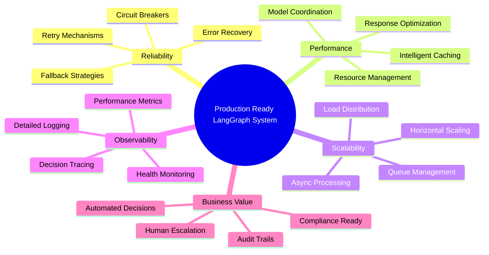

**Готовы создавать enterprise AI-системы с LangGraph!** 🚀

---

## 👨‍💻 Behind the Code

Этот проект возник из понимания того, что современные ИИ-системы требуют не просто "работающий код", а корпоративную архитектуру. Изучая LangGraph, я столкнулся с недостатком практических примеров сложных многомодельных процессов с правильной обработкой ошибок и стратегиями отказоустойчивости. Иногда лучшие обучающие проекты - это те, которые показывают реальные паттерны, а не игрушечные примеры.

**Больше практических технических проектов**: [@it_jagger](https://t.me/it_jagger)

## Поддержать проект:

ETH (Mainnet): `0x765885e6Cb9e40E1504F80272A7b5B60ffF7b92d`  
USDT (SOL): `GRNmdL1mpdBhgY8cFZggUo5k9eG5ic5QtA6NFTv6ZAbw`

---

*Проект демонстрирует real-world паттерны для построения надежных AI-систем в production среде.*